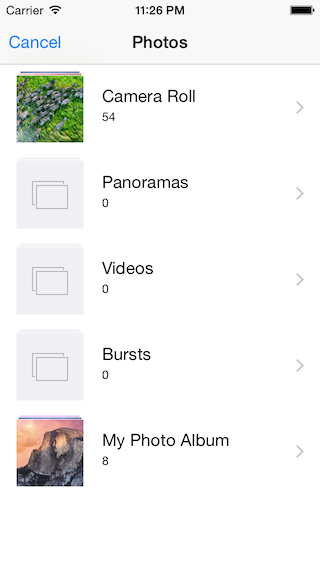
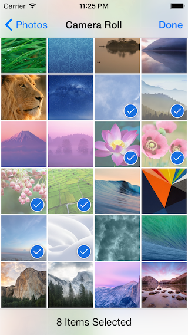

# QBImagePicker

A clone of UIImagePickerController with multiple selection support.





## Features

- Allows multiple selection of photos and videos, even from the different albums
- Provides similar user interface to the built-in image picker
- Customizable (grid size, navigation message, etc.)
- Supports both portrait mode and landscape mode
- Compatible with iPhone 6/6Plus, and iPad


## Example

    QBImagePickerController *imagePickerController = [QBImagePickerController new];
    imagePickerController.delegate = self;
    imagePickerController.allowsMultipleSelection = YES;
    imagePickerController.maximumNumberOfSelection = 6;
    imagePickerController.showsNumberOfSelectedAssets = YES;

    [self presentViewController:imagePickerController animated:YES completion:NULL];


## Requirements

- Version `>= 3.0.0` : iOS 8 or later (Using PhotoKit)
- Version `< 3.0.0` : iOS 6 or later (Using AssetsLibrary)


## Installation

### CocoaPods

1. Add `pod "QBImagePickerController"` to Podfile
2. Run `pod install`
3. Add `#import <QBImagePickerController/QBImagePickerController.h>` to your code


### Carthage

1. Add `github "questbeat/QBImagePicker"` to Cartfile
2. Run `carthage update`
3. Add `#import <QBImagePicker/QBImagePicker.h>` to your code


## Usage

### Basic

1. Implement `QBImagePickerDelegate` methods
2. Create `QBImagePickerController` object
3. Set `self` to the `delegate` property
4. Show the picker by using `presentViewController:animated:completion:`

```
QBImagePickerController *imagePickerController = [QBImagePickerController new];
imagePickerController.delegate = self;

[self presentViewController:imagePickerController animated:YES completion:NULL];
```


### Delegate Methods

##### - qb_imagePickerController:didSelectAsset:

This method will be called when the user finished picking asset in **single** selection mode.  
The second argument is `ALAsset` object.


##### - qb_imagePickerController:didSelectAssets:

This method will be called when the user finished picking asset in **multple** selection mode.  
The second argument is an array of `ALAsset` object.


##### - qb_imagePickerControllerDidCancel:

This method will be called when the user hits the "Cancel" button.


##### - qb_imagePickerController:shouldSelectAsset:

By implementing this method you can decide the asset can be selected or not.


### Customization

#### Selection mode

When `allowsMultipleSelection` is `YES`, the user can select multiple photos.  
The default value is `NO`.

    imagePickerController.allowsMultipleSelection = YES;

You can limit the number of selection by using `minimumNumberOfSelection` and `maximumNumberOfSelection` property.  
The default value is `0`, which means the number of selection is unlimited.

    imagePickerController.minimumNumberOfSelection = 3;
    imagePickerController.maximumNumberOfSelection = 6;


#### Specify the albums to be shown

Use `groupTypes` property to specify the albums to be shown.  
The code below shows the default value.

    imagePickerController.groupTypes = @[
        @(ALAssetsGroupSavedPhotos), // Camera Roll
        @(ALAssetsGroupPhotoStream), // My Photo Stream
        @(ALAssetsGroupAlbum) // User Albums
    ];

The albums will be ordered as you specified.  


#### Specify the media type to be shown

Use `filterType` to filter the assets to be shown.  
The default value is `QBImagePickerControllerFilterTypeNone`.

    // Show videos only
    imagePickerController.filterType = QBImagePickerControllerFilterTypeVideos;


#### Showing information

There are some properties to show helpful information.

    imagePickerController.prompt = @"Select the photos you want to upload!";
    imagePickerController.showsNumberOfSelectedAssets = YES;


#### Grid size

Use `numberOfColumnsInPortrait` and `numberOfColumnsInLandscape` to change the grid size.  
The code below shows the default value.

    imagePickerController.numberOfColumnsInPortrait = 4;
    imagePickerController.numberOfColumnsInLandscape = 7;


## License

Copyright (c) 2015 Katsuma Tanaka

Permission is hereby granted, free of charge, to any person obtaining a copy of this software and associated documentation files (the "Software"), to deal in the Software without restriction, including without limitation the rights to use, copy, modify, merge, publish, distribute, sublicense, and/or sell copies of the Software, and to permit persons to whom the Software is furnished to do so, subject to the following conditions:

The above copyright notice and this permission notice shall be included in all copies or substantial portions of the Software.

THE SOFTWARE IS PROVIDED "AS IS", WITHOUT WARRANTY OF ANY KIND, EXPRESS OR IMPLIED, INCLUDING BUT NOT LIMITED TO THE WARRANTIES OF MERCHANTABILITY, FITNESS FOR A PARTICULAR PURPOSE AND NONINFRINGEMENT. IN NO EVENT SHALL THE AUTHORS OR COPYRIGHT HOLDERS BE LIABLE FOR ANY CLAIM, DAMAGES OR OTHER LIABILITY, WHETHER IN AN ACTION OF CONTRACT, TORT OR OTHERWISE, ARISING FROM, OUT OF OR IN CONNECTION WITH THE SOFTWARE OR THE USE OR OTHER DEALINGS IN THE SOFTWARE.
